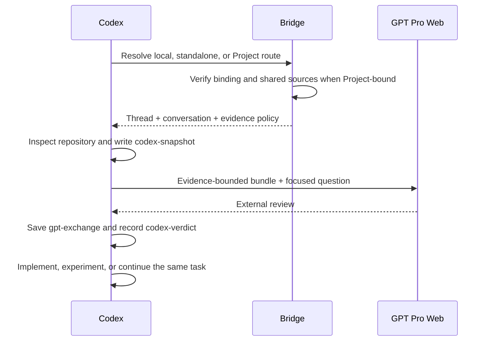
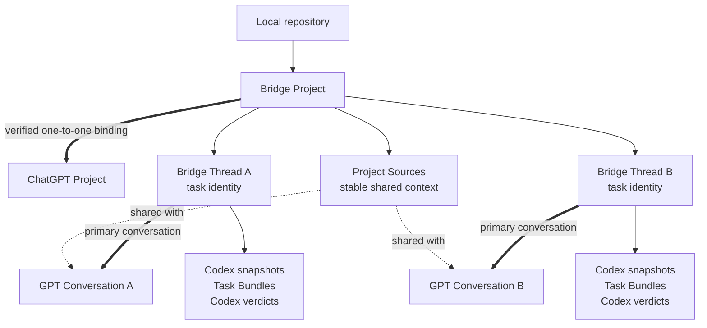
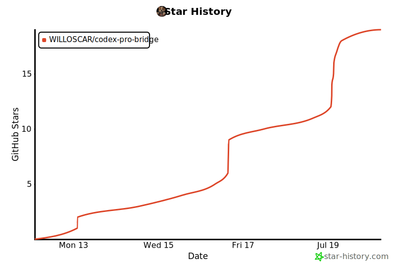

# Codex Pro Bridge

[中文说明](README.zh-CN.md)

## Introduction

Codex Pro Bridge is built for work that moves back and forth between algorithm design, research reasoning, and engineering implementation.

Codex and GPT Pro are both useful, but they are useful in different places and at different speeds.

Codex belongs close to the local repository. It can read files, change code, run tests, inspect logs, and check whether a proposal actually matches the current implementation.

GPT Pro is better suited to slower external reasoning: challenging an algorithm, mapping failure modes, designing ablations, planning experiments, framing a paper, or trying to disprove an idea.

The fragile part is the handoff between them.

### The problem

Without a bridge, the workflow becomes a loop through the repository, Codex, and a browser, held together by manual copy and paste.

The external model does not automatically know the repository state, current implementation, local experiments, or decisions already made by Codex.

Providing that context quickly becomes a choice between too little and too much.

Too little context produces confident advice about code the reviewer never saw. Too much context is noisy, expensive to inspect, hard to update, and more likely to include unrelated or sensitive material.

### The workflow pain

The handoff creates several kinds of loss:

- **Attention loss:** work repeatedly switches between the repository, Codex, and the browser.
- **Structure loss:** prompts, files, assumptions, follow-ups, and decisions scatter as they are copied between tools.
- **Reproducibility loss:** later it becomes difficult to know exactly what evidence GPT Pro reviewed.
- **State drift:** the web conversation continues while the repository, experiments, and implementation change underneath it.
- **Implementation loss:** a useful algorithm or research idea never makes it back into tests, configs, logs, and working code.

In one round, these are workflow frictions. Across several rounds, they make the review difficult to reuse, audit, or implement.

The missing piece is not another chat window. It is a reproducible handoff between local execution and external reasoning.

### The idea

Codex Pro Bridge is not an API client, and it does not let GPT Pro edit local files directly.

It is a local workflow layer made of Codex skills and helper scripts. It turns a GPT Pro web review into engineering material that can be reused, traced, and connected back to the real repository.

The workflow is:

1. Codex routes the request to local work, a standalone review, or the
   repository's bound ChatGPT Project.
2. Codex writes local notes for one concrete task.
3. Codex builds a bundle with an explicit evidence boundary.
4. GPT Pro reviews that scoped material in the correct web conversation.
5. Codex saves the complete answer, summarizes it, and verifies actionable claims locally.
6. The same task continues into implementation, experiments, or another focused review round.



The goal is to make the loop reusable, auditable, and implementable. Codex remains the source of truth; GPT Pro remains an external reviewer.

## How it works

Each task uses one bridge thread so the evidence, external review, local verdict, implementation, and later follow-ups remain connected.

### Execution scopes

The same task protocol supports three execution scopes:

| Scope | Shape | Best for |
| --- | --- | --- |
| `local_only` | Codex works directly | Work that needs no external review |
| `standalone` | One Bridge Thread and one GPT conversation | Small projects and one-off reviews |
| `project` | One repository-bound Project with many task Threads | Long-running research with shared sources and several conversations |

### Project mode

Project mode is an optional layer above the original Bridge Thread workflow. It
is useful when one repository has several durable tasks, several GPT
conversations, and a set of background files that should be shared between
them. Small projects can stay standalone.



The relationship is intentionally narrow: one local root has at most one Bridge
Project, and one Bridge Project has at most one current ChatGPT Project
binding. Titles are only display metadata; the bridge verifies the visible
Project URL and ID together with the active account and workspace before
Project routing becomes active.

Project mode adds the following behavior:

| Capability | Behavior |
| --- | --- |
| Verified Project binding | Bind an existing ChatGPT Project or create a new one, then verify its visible identity before use |
| Automatic routing | Choose `local_only`, `standalone`, or `project`; block Project submission when the binding or shared sources need repair |
| Shared Project Sources | Synchronize stable material such as a project brief, glossary, PRD, or durable decisions for use across Project conversations |
| Safe source updates | Plan from a complete remote inventory, scan selected files, respect capacity, and modify only Bridge-managed versions |
| Multiple tasks | Keep independent deliverables in independent Bridge Threads and GPT conversations while follow-up rounds reuse the current task |
| Project lifecycle | Track task state and dependencies; attach older standalone Threads; archive, reactivate, unbind, or recover a missing binding without deleting remote content |
| Local audit trail | Keep binding, source, task, and verification events in local append-only state rather than relying on browser memory |

Project Sources and Task Bundles serve different jobs. Stable project context is
shared through the ChatGPT Project. Diffs, logs, code slices, experiment
results, and one-round questions remain inside immutable Task Bundles, so each
review still has an exact evidence boundary.

Source ownership is conservative. Existing remote files, instructions, and
conversations are treated as user-managed. `read_only` never changes remote
sources, `append_only` adds new Bridge versions while retaining older ones, and
`managed` may replace an older Bridge-managed version only after the new one is
visible. None of these modes permits automatic deletion of user-managed
content.

A conversation already bound to the current Bridge Thread is reused. Existing
remote Project conversations remain external until the user explicitly adopts
one; the bridge does not silently guess between unrelated chats or rebind a
saved conversation URL.

The Bridge Thread remains the task identity, so Project mode does not add a
duplicate Workstream layer. Existing standalone history can be attached to a
Project later without rewriting old events. Local Bridge state records IDs,
digests, statuses, verified observations, and the review artifacts intentionally
captured for the task. It does not store browser cookies, access tokens, or
unrelated private web responses.

Whatever the scope, the bridge keeps three concerns separate:

- **Evidence construction:** build the smallest package that can support the decision.
- **External reasoning:** ask a focused question against exactly that evidence.
- **Local verification:** check every actionable conclusion before changing code or trusting a result.

### Evidence modes

| Mode | Use it for | Repository source |
| --- | --- | --- |
| `auto` | First implementation-heavy round | Select a focus, close conservative local dependencies, then add relevant breadth |
| `explicit` | Focused follow-up | Send only the files that need another review |
| `none` | Reasoning-only follow-up | Reuse current notes and task context without resending source |

Auto mode follows definitely-local relative imports for JavaScript/TypeScript and Python. Modern Node source and test files such as `.mjs`, `.cjs`, `.mts`, and `.cts` are supported.

Follow-up rounds normally reuse current Codex notes and compact task history. Source is added again only when it changed or the reviewer needs to inspect it.

## When to use it

Codex Pro Bridge is useful when the decision benefits from an independent reasoning pass:

- Reviewing an algorithm, training pipeline, reward design, or evaluation method.
- Stress-testing a research claim, paper framing, novelty argument, or reviewer story.
- Turning a proposal into baselines, ablations, metrics, and decision rules.
- Checking whether code, configs, data splits, commands, logs, and reported results agree.
- Carrying a complex review across several rounds without losing provenance.

For a small local bug, formatting change, or straightforward implementation task, Codex should usually work directly in the repository without this bridge.

## Quick start

### Prerequisites

Before using the bridge for the first time:

1. Use a US-region network connection to install and enable the [Codex extension](https://chromewebstore.google.com/detail/codex/hehggadaopoacecdllhhajmbjkdcmajg) from the Chrome Web Store.
2. Open `chrome://extensions/?id=hehggadaopoacecdllhhajmbjkdcmajg`, open the extension's **Details**, and enable **Allow access to file URLs**.
3. Sign in to ChatGPT with the same Chrome profile that Codex will use.

These are one-time setup steps. The selected skill checks them again before an external review round.

### Install

Global installation:

```bash
./codex-pro-bridge-skills/install.sh --global
```

Repository-local installation:

```bash
./codex-pro-bridge-skills/install.sh --repo /path/to/repo
```

Restart Codex or open a new task if an existing task does not discover the updated skills.

### Ask a normal question

```text
Use $gpt-pro-question-window.
Route this task automatically and ask GPT Pro:
<question>
Capture the raw answer, verify it locally,
and record a separate Codex verdict.
```

The skill preserves the existing CLI-style workflow: it chooses a Thread and
conversation automatically. It asks for intervention only when a Project must
be created, bound, or repaired.

### Bind a long-running Project

```text
Use $gpt-pro-project-workspace.
Bind this repository to my existing ChatGPT Project,
verify the visible Project/account identity,
and plan stable Project Sources without deleting user-managed files.
```

This is normally a one-time setup. After the binding is active, ordinary
external questions still begin with `$gpt-pro-question-window` or one of the
specialized review skills. The router selects Project mode when the current
repository and task already belong there.

### Maintain a bound Project

```text
Use $gpt-pro-project-workspace.
Inspect the current binding, tasks, and Project Sources.
Refresh these stable sources:
<files>
Preview the plan first, and do not delete user-managed content.
```

The same skill can update task metadata, reconcile missing or stale sources,
archive or reactivate the local Bridge Project, and repair a binding after the
remote Project becomes visible again.

### Run the full algorithm or research loop

```text
Use $gpt-pro-algorithm-pipeline.
Run the Codex -> GPT Pro -> Codex loop for:
<task>
Keep one bridge thread, send only scoped evidence,
and implement only locally verified changes.
```

More examples are available in [examples/usage_prompts.md](codex-pro-bridge-skills/examples/usage_prompts.md).

## Skills

| Skill | Purpose |
| --- | --- |
| `gpt-pro-project-workspace` | Bind, route, synchronize, inspect, and repair Project-aware work |
| `gpt-pro-question-window` | Ask a normal question or continue an existing external review |
| `bundle-algorithm-context` | Build a scoped evidence package for a source-backed round |
| `gpt-pro-research-algorithm-reviewer` | Review algorithms, pipelines, experiments, and research claims |
| `gpt-pro-paper-brainstormer` | Develop paper framing, novelty, objections, and experiment story |
| `experiment-plan-generator` | Convert an idea or review into an experiment matrix |
| `implementation-consistency-checker` | Check consistency across proposal, code, configs, data, evaluation, and results |
| `gpt-pro-algorithm-pipeline` | Run the complete evidence, review, verification, experiment, and implementation loop |

Use `$experiment-plan-generator` and `$implementation-consistency-checker` locally when outside reasoning is unnecessary.

## Documentation

- [Workflow overview](codex-pro-bridge-skills/docs/WORKFLOW.md)
- [Canonical bridge protocol](codex-pro-bridge-skills/.agents/skills/gpt-pro-question-window/references/bridge_protocol.md)
- [Bridge Project protocol](codex-pro-bridge-skills/.agents/skills/gpt-pro-project-workspace/references/project_protocol.md)
- [Evidence bundle schema](codex-pro-bridge-skills/.agents/skills/bundle-algorithm-context/references/bundle_schema.md)
- [AGENTS.md integration snippet](codex-pro-bridge-skills/docs/AGENTS_APPEND_SNIPPET.md)

## Star History

<a href="https://www.star-history.com/?repos=WILLOSCAR%2Fcodex-pro-bridge&type=date&legend=top-left">
  <picture>
    <source media="(prefers-color-scheme: dark)" srcset="assets/star-history/star-history-dark.svg">
    
  </picture>
</a>

## Acknowledgements

Thanks to the [Linux.do](https://linux.do/) community for its discussions, feedback, and support.
