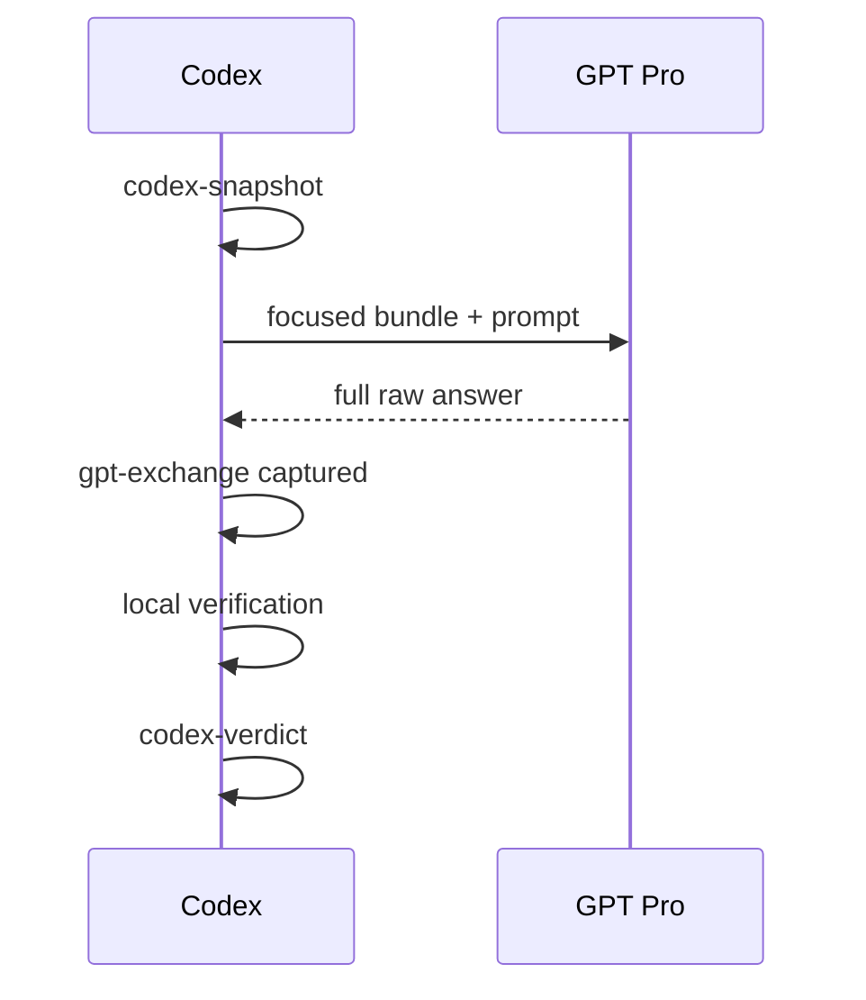

# Codex Pro Bridge

Codex Pro Bridge connects local Codex work with external reasoning in the signed-in ChatGPT/GPT Pro web UI.

Codex remains the local source of truth: it selects evidence, reads and changes code, runs tests, and verifies claims. GPT Pro receives a scoped evidence package and returns an external review. The bridge preserves each handoff without treating the external answer as ground truth.

## Skills

| Skill | Purpose |
| --- | --- |
| `gpt-pro-question-window` | Browser and persistence adapter: upload, ask, capture the raw answer, then record Codex verification. |
| `bundle-algorithm-context` | Build a scoped, immutable evidence bundle with an explicit evidence contract. |
| `gpt-pro-research-algorithm-reviewer` | Deep algorithm, pipeline, experiment, and research review. |
| `gpt-pro-paper-brainstormer` | Paper claim, novelty, reviewer-objection, and experiment-story review. |
| `experiment-plan-generator` | Convert a review into a minimal experiment matrix and decision rule. |
| `implementation-consistency-checker` | Verify proposal, code, config, commands, data splits, eval, logs, and metrics. |
| `gpt-pro-algorithm-pipeline` | Orchestrate the complete evidence, review, verification, experiment, and implementation loop. |

## Mechanism

One task exposes one required `bridge-thread-id`. Codex and GPT Pro session IDs are derived unless an existing compatible session is explicitly reused.



The canonical timeline is append-only JSONL. Markdown timelines, indexes, and the sequence diagram are derived views. Immutable snapshots, bundles, GPT Pro turns, and Codex verdicts are linked by repository-relative paths and SHA-256 digests.

Bundle construction attempts are not task events. The bundle actually sent is recorded with the corresponding GPT exchange. This keeps smoke tests and abandoned drafts out of the task history.

The complete state contract and commands live in [bridge_protocol.md](codex-pro-bridge-skills/.agents/skills/gpt-pro-question-window/references/bridge_protocol.md).

## Multi-round work

The first round may include focused code, configs, docs, and results. Follow-up rounds normally send current Codex notes and a compact recent event window. Add files again only when they changed or GPT Pro must inspect them.

Capture the raw GPT Pro answer immediately. Record Codex verification later as a separate verdict; never edit the external answer to make later conclusions look contemporaneous.

## Install

Browser prerequisite:

1. Install and enable the Codex extension in Chrome. In this environment, use a US-region network node while downloading it from the Chrome Web Store.
2. Open `chrome://extensions/`, select the Codex extension, open **Details**, and enable **Allow access to file URLs**.

Without this permission, Chrome may open the upload control but fail to attach the local bundle.

Global:

```bash
./codex-pro-bridge-skills/install.sh --global
```

Repository-local:

```bash
./codex-pro-bridge-skills/install.sh --repo /path/to/repo
```

The installer replaces only the seven managed skills and their hidden shared runtime. It removes stale files inside those managed directories and leaves unrelated global skills untouched.

Repository-local installation also adds `.agents/` and `.codex/` to that repository's local `.git/info/exclude`, preventing local skills and bridge artifacts from appearing in commits.

Restart Codex if an existing session does not discover the updated skills.

## Use

Normal question:

```text
Use $gpt-pro-question-window.
Use bridge thread <repo>-<date>-<task> and ask GPT Pro:
<question>
Capture the raw answer, verify it locally, and record a separate Codex verdict.
```

Full algorithm/research loop:

```text
Use $gpt-pro-algorithm-pipeline.
Run the Codex -> GPT Pro -> Codex loop for:
<task>
Keep one bridge thread, send only scoped evidence, and do not act on unverified claims.
```

## Safety

- Keep evidence inside the repository by default. External includes require explicit approval and receive anonymized archive names.
- Reject missing includes, immutable-artifact overwrites, session rebinding, and high-confidence secret patterns.
- Do not upload env files, credentials, cookies, keys, databases, raw private data, or unrelated artifacts.
- Uploaded manifests use a safe repository label, never the absolute local path.
- Use signed-in Chrome with the Codex extension installed and enabled. Keep **Allow access to file URLs** on; use Computer Use only for UI boundaries Chrome cannot control.
- Stop for login, password, 2FA, CAPTCHA, rate-limit, abuse, or account-security prompts.
- Never publish `.codex/` bridge artifacts unless the user explicitly chooses to do so.

## Validate

```bash
cd codex-pro-bridge-skills
python3 -m unittest discover -s tests -v
python3 tests/validate_skills.py
```

The test and validation path uses only the Python standard library.
