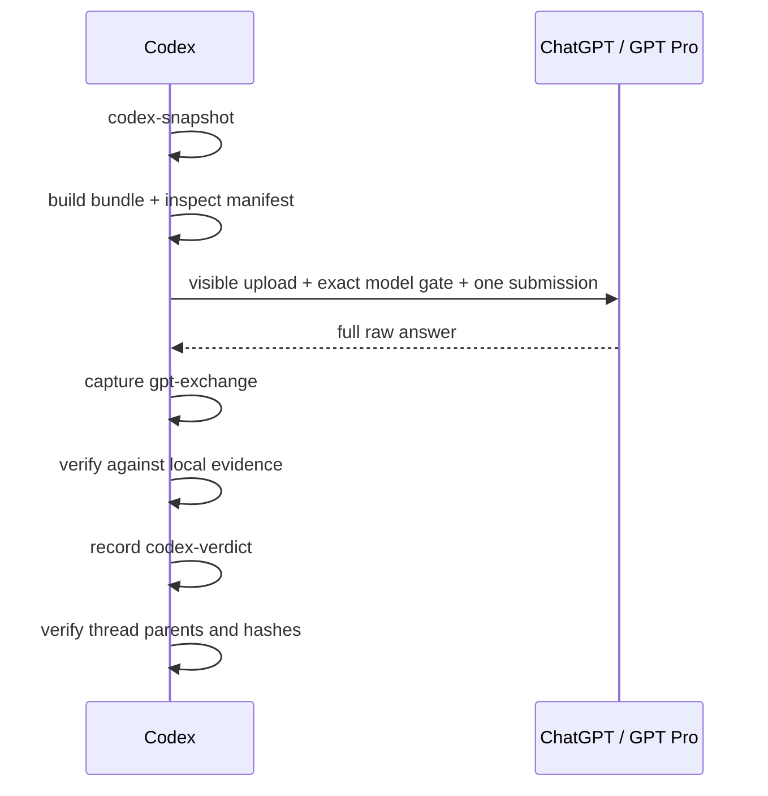

# Codex Pro Bridge

[中文说明](README.zh-CN.md)

Codex Pro Bridge is a supervised workflow for sending scoped local evidence to a signed-in ChatGPT conversation, preserving the raw answer, and verifying every actionable claim back in the repository.

Codex remains the source of truth. The bridge does not give the web model direct control of the repository and does not treat an external answer as verified implementation guidance.

## What it guarantees

- One stable `bridge-thread-id` per task.
- Immutable Codex snapshots, sent bundles, raw GPT exchanges, and Codex verdicts.
- Repository-relative artifact paths and SHA-256 digests.
- Fail-closed explicit evidence selection by default.
- Exact visible model and attachment checks before browser submission.
- Local verification before implementation or result sign-off.
- Parent-chain, artifact-hash, and bundle-hash verification before handoff.

## What it does not guarantee

- A visible `Pro` label proves the selected UI option, not the backend model identity.
- Auto selection is conservative, not whole-program dependency analysis.
- The bridge is not an unattended browser service. Login, CAPTCHA, rate limits, and UI changes still require supervision.
- GPT output is advice until Codex verifies it against local code, tests, configs, data, or logs.

## Quick start

### 1. Prepare Chrome

Install and enable the Codex Chrome extension. Open `chrome://extensions/`, select the extension, open **Details**, and enable **Allow access to file URLs**.

Without this permission, Chrome may open the upload menu but fail to attach a local bundle.

### 2. Install the skills

Global installation:

```bash
./codex-pro-bridge-skills/install.sh --global
```

Repository-local installation:

```bash
./codex-pro-bridge-skills/install.sh --repo /path/to/repo
```

Repository-local installation adds `.agents/` and `.codex/` to that repository's local `.git/info/exclude`. It does not edit the tracked `.gitignore`.

Restart Codex or open a new task if an existing task does not discover the updated skills.

### 3. Ask Codex to run a bridge task

Normal question:

```text
Use $gpt-pro-question-window.
Use bridge thread <repo>-<date>-<task> and ask GPT Pro:
<question>
Require the exact visible Pro selection, capture the raw answer,
verify it locally, and record a separate Codex verdict.
```

Full algorithm or research loop:

```text
Use $gpt-pro-algorithm-pipeline.
Run the Codex -> GPT Pro -> Codex loop for:
<task>
Keep one bridge thread, send only scoped evidence,
and implement only locally verified changes.
```

More prompts are available in [examples/usage_prompts.md](codex-pro-bridge-skills/examples/usage_prompts.md).

## Workflow

Every external round follows the same lifecycle:



Bundle drafts are not timeline events. Only the bundle actually sent is bound to the captured `gpt-exchange`.

The raw answer and Codex verdict remain separate. Later verification never rewrites the external answer to make it look contemporaneous.

## Evidence modes

| Mode | Use it for | Repository source |
| --- | --- | --- |
| `auto` | First implementation-heavy round | Explicit focus seeds when supplied, conservative local dependency closure, then ranked breadth |
| `explicit` | Focused follow-up | Only named files; missing, filtered, or over-budget evidence fails by default |
| `none` | Reasoning-only follow-up | No repository source; current notes and compact thread context only |

Auto mode follows definitely-local relative imports for JavaScript/TypeScript and Python. It also supports modern Node source and test files such as `.mjs`, `.cjs`, `.mts`, and `.cts`.

Auto mode records why each file was included. If a required closure exceeds `--max-files`, the build fails instead of silently truncating the evidence.

Use `--allow-incomplete-includes` or `--allow-incomplete-auto-context` only after inspecting and accepting every recorded evidence gap.

## Browser interaction

Use ChatGPT's visible attachment button and visible upload menu item. Do not directly click a hidden input such as `#upload-files`.

Before clicking Send, verify the exact visible model label and attachment name:

The commands below assume repository-local installation. For a global installation, replace `.agents/skills` with `${CODEX_HOME:-$HOME/.codex}/skills`.

```bash
python3 .agents/skills/gpt-pro-question-window/scripts/check_browser_preflight.py \
  --requested-model Pro \
  --selected-ui-label '<exact visible label>' \
  --bundle /absolute/path/to/bundle.zip \
  --attachment-name '<visible filename>' \
  --upload-control visible-menu
```

Only submit when preflight succeeds. `极高`, an account name containing “Pro”, and the exact `Pro` model option are different observations.

The preflight makes UI observations explicit and fail-closed. It does not independently attest the backend model identity.

Submit once. While generation remains visibly active, keep waiting and report progress rather than resending. On a stalled or protected state, capture diagnostics and stop.

If a response was already produced under a mismatched or unverified model, preserve the raw answer and record that provenance truthfully. Do not relabel it as Pro.

## State and verification

Bridge state is stored under:

```text
.codex/codex-pro-bridge/
  threads/             # canonical JSONL ledger + derived Markdown views
  codex-sessions/      # mutable notes + immutable snapshots
  gpt-pro-sessions/    # raw exchanges + separate Codex verdicts
  bundles/             # immutable evidence packages
```

The JSONL ledger is canonical. Markdown timelines, indexes, and sequence diagrams are derived views.

Before a follow-up round or final handoff, verify the thread:

```bash
python3 .agents/skills/gpt-pro-question-window/scripts/verify_bridge_thread.py \
  --repo . \
  --bridge-thread-id <thread-id> \
  --require-complete-rounds
```

The verifier checks event order, parent links, event roles, artifact paths, artifact hashes, bundle hashes, and incomplete final rounds.

## Skills

| Skill | Purpose |
| --- | --- |
| `gpt-pro-question-window` | Browser control, exact preflight, raw capture, persistence, and thread verification |
| `bundle-algorithm-context` | Scoped immutable evidence bundles with an explicit evidence contract |
| `gpt-pro-research-algorithm-reviewer` | Algorithm, pipeline, experiment, and research review |
| `gpt-pro-paper-brainstormer` | Claims, novelty, reviewer objections, and experiment story |
| `experiment-plan-generator` | Minimal experiment matrices and decision rules |
| `implementation-consistency-checker` | Proposal, code, config, data, evaluation, logs, and metric consistency |
| `gpt-pro-algorithm-pipeline` | Complete evidence, review, verification, experiment, and implementation loop |

Use `$experiment-plan-generator` and `$implementation-consistency-checker` locally when outside reasoning is unnecessary.

## Safety

- Keep evidence inside the repository by default.
- Inspect and approve every external include; external archive names are anonymized.
- Exclude env files, credentials, cookies, keys, databases, raw private data, vendor trees, and large unrelated artifacts.
- Fail on high-confidence secret patterns unless the exact files were manually reviewed.
- Never move an existing session to another bridge thread or ChatGPT conversation URL.
- Stop for login, password, 2FA, CAPTCHA, rate limits, abuse warnings, or account-security prompts.
- Do not publish `.codex/` bridge artifacts unless the user explicitly chooses to do so.

## Development and validation

```bash
cd codex-pro-bridge-skills
python3 -m unittest discover -s tests -v
python3 tests/validate_skills.py
```

The repository test and validation path uses only the Python standard library.

## Further documentation

- [Workflow overview](codex-pro-bridge-skills/docs/WORKFLOW.md)
- [Canonical bridge protocol](codex-pro-bridge-skills/.agents/skills/gpt-pro-question-window/references/bridge_protocol.md)
- [Evidence bundle schema](codex-pro-bridge-skills/.agents/skills/bundle-algorithm-context/references/bundle_schema.md)
- [AGENTS.md integration snippet](codex-pro-bridge-skills/docs/AGENTS_APPEND_SNIPPET.md)
