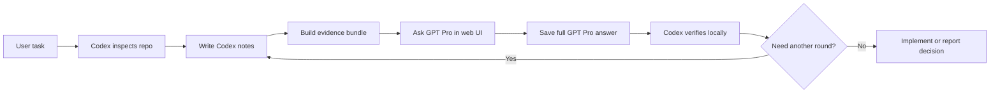

# Codex Pro Bridge

Codex Pro Bridge connects local Codex work with GPT Pro in the ChatGPT web UI, while keeping the repository as the source of truth.

It is built for algorithm, research, and engineering loops where Codex and GPT Pro are useful for different reasons.

Codex is strongest inside the repo. It reads files, edits code, runs tests, inspects logs, and checks whether a proposal matches the actual implementation.

GPT Pro is useful when the question needs slower external reasoning: algorithm critique, failure-mode discovery, ablation design, experiment planning, paper framing, and adversarial review.

The fragile part is the handoff. Without a bridge, the workflow becomes browser switching and copy/paste. Context loses shape, decisions scatter, and the web conversation can drift away from the real code.

This package gives the loop a durable shape. Codex writes local notes, builds an evidence-bounded bundle, asks GPT Pro through the web UI, saves the full answer locally, summarizes it, verifies it against the repo, and updates the same task timeline before the next round.

## What This Is

Codex Pro Bridge is not an API client and it does not make GPT Pro edit files directly.

It is a local workflow layer made of Codex skills and helper scripts. It turns a GPT Pro web conversation into a local engineering artifact that can be reused, audited, and connected back to code.

## Why It Exists

The bridge is meant to reduce several common losses:

- Attention loss from switching between the repo, Codex, and the browser.
- Structure loss when prompts, files, assumptions, follow-ups, and decisions are copied manually.
- Reproducibility loss when nobody knows what GPT Pro saw in a previous round.
- State drift when the web conversation no longer matches the current repository.
- Implementation loss when a good research idea never makes it back into tests, configs, logs, or code.

## Included Skills

The package lives under `codex-pro-bridge-skills/.agents/skills`.

| Skill | Purpose |
| --- | --- |
| `gpt-pro-question-window` | Open or reuse a signed-in GPT Pro web conversation, ask a scoped question, optionally attach context, and save the response. |
| `bundle-algorithm-context` | Build a compact direct-evidence bundle from code, configs, docs, logs, and notes while excluding unsafe or oversized files. |
| `gpt-pro-research-algorithm-reviewer` | Ask GPT Pro for deep algorithm or research review: assumptions, failure modes, evaluation, ablations, novelty, and go/no-go guidance. |
| `gpt-pro-paper-brainstormer` | Refine paper framing, claims, reviewer objections, novelty, and experiment narrative. |
| `experiment-plan-generator` | Convert a review into a prioritized experiment matrix and executable checklist. |
| `implementation-consistency-checker` | Verify that proposals, code, configs, data splits, eval scripts, and logs agree with each other. |
| `gpt-pro-algorithm-pipeline` | Run the full loop: bundle context, ask GPT Pro, verify locally, plan experiments, and implement only the safe next step. |

## Core Model

The workflow keeps one task-level thread and two endpoint sessions.

| Object | Meaning |
| --- | --- |
| Bridge thread | The task timeline shared by Codex and GPT Pro rounds. |
| Codex session | The local Codex-side state: summary, recent raw turns when available, decisions, verification, and next question. |
| GPT Pro session | One GPT Pro web conversation, plus numbered saved turns copied back to the repo. |
| Bundle | A per-round evidence package, usually a zip for source files plus a small manifest. |

Use one `bridge-thread-id` for the whole task. Derive the two endpoint IDs from it:

```text
Bridge thread: <task>-<YYYYMMDD>-<short-topic>
Codex session: <bridge-thread-id>-codex
GPT Pro session: <bridge-thread-id>-gpt-pro
```

The bridge thread is the durable spine. Helpers do not pass a separate graph around; they only reuse the same `bridge-thread-id`. Each helper call appends a structured event to that thread: `codex-update`, `bundle`, or `gpt-pro-turn`.

The Mermaid `gitGraph` is a view derived from that append-only thread ledger. Codex-side events stay on the main line, while GPT Pro turns are shown as GPT Pro-side events. The graph can be regenerated from the thread at any time, so it stays light and has no separate state to keep in sync.

## Workflow



The important handshake is:

- Before GPT Pro: Codex makes local state explicit in notes and a bundle.
- During GPT Pro: only the scoped bundle or follow-up context is pasted or uploaded.
- After GPT Pro: Codex saves the full answer, summarizes it, verifies it locally, and records the decision trail.
- Next round: Codex reuses the same bridge thread, but usually sends only notes plus the session graph.

For multi-round work, the first GPT Pro round may include code or config evidence. Later rounds usually carry Codex notes, compact thread context, and the session graph. Each round appends one event to the same bridge thread, and the graph is generated from that shared timeline. Add files again only when they changed or GPT Pro needs to inspect them.

## Install

### Global Codex Install

```bash
mkdir -p ~/.codex/skills
cp -R codex-pro-bridge-skills/.agents/skills/* ~/.codex/skills/
```

Restart Codex if the skills do not appear.

### Repo-Local Install

```bash
mkdir -p /path/to/repo/.agents
cp -R codex-pro-bridge-skills/.agents/skills /path/to/repo/.agents/
```

## Quick Prompts

Normal GPT Pro question:

```text
Use $gpt-pro-question-window.
Open a GPT Pro conversation and ask:
[question]
Save the full answer as the next turn in the current GPT Pro session, then summarize the useful parts.
Use bridge thread <bridge-thread-id> for this task.
```

Deep algorithm review:

```text
Use $gpt-pro-research-algorithm-reviewer.
I want a deep algorithm review, not a normal code review.
Goal: [algorithm/pipeline/research goal]
Focus files: [paths]
Current concern: [what feels uncertain]
Return: diagnosis, failure modes, ablation plan, implementation checkpoints, and a go/no-go decision.
```

Full Codex -> GPT Pro -> Codex loop:

```text
Use $gpt-pro-algorithm-pipeline.
Run the full Codex -> GPT Pro -> Codex algorithm review loop for:
[task]
After GPT Pro responds, verify the claims against the repo, filter hallucinations, produce a minimal experiment plan, and implement only the safe next step.
```

## Safety Rules

- Do not upload `.env`, credentials, cookies, private keys, tokens, databases, or full user data dumps.
- The bundle builder excludes obvious secret, env, raw-data, database, vendor, and large artifact files by path and name.
- Normal included source, config, doc, and log contents are not rewritten. They are either included as evidence or omitted.
- If ChatGPT is not signed in, ask the user to sign in manually. Do not enter passwords or 2FA codes.
- Prefer one GPT Pro conversation. Use two or three only when useful, and never exceed three concurrent conversations.
- Add small varied waits between paste, upload, submit, copy, and navigation actions.
- Stop for CAPTCHA, rate-limit, abuse-warning, unusual login, or account-security prompts.
- Treat GPT Pro output as external review, not ground truth.
- Let Codex verify every suggested change against code, configs, tests, and logs before editing.
