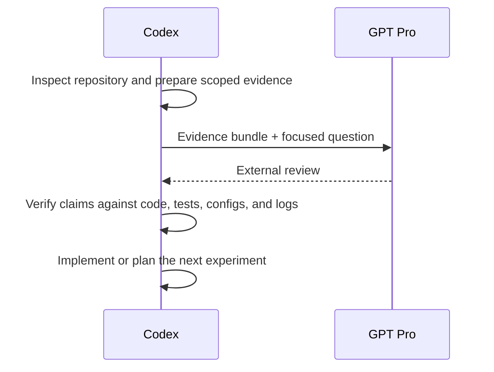

# Codex Pro Bridge

[中文说明](README.zh-CN.md)

## Introduction

Codex is good at working inside a repository: it can inspect code, edit files, run tests, and verify behavior.

A strong reasoning model is useful for a different class of work: algorithm review, research critique, experiment design, and long-horizon analysis.

The hard part is connecting the two.

### The problem

An external model does not automatically know the repository state, current implementation, local experiments, or decisions already made by Codex.

The usual workaround is manual copy and paste. That quickly becomes a choice between too little context and too much context.

Too little context produces confident advice about code the reviewer never saw. Too much context is noisy, expensive to inspect, hard to update, and more likely to include unrelated or sensitive material.

### The workflow pain

Even when the first handoff works, multi-round collaboration is fragile:

- The answer may no longer match the code snapshot it reviewed.
- Follow-up questions repeatedly resend the same files.
- Raw external suggestions become mixed with locally verified facts.
- The final implementation loses the reasoning and evidence that led to it.

The missing piece is not another chat window. It is a reproducible handoff between local execution and external reasoning.

### The idea

Codex Pro Bridge turns that handoff into a task workflow:

1. Codex selects the evidence needed for one concrete decision.
2. GPT Pro reviews only that scoped evidence.
3. Codex returns to the repository, verifies the review, and acts only on supported conclusions.



Codex remains the source of truth. GPT Pro acts as an external reviewer, not as the process that edits or validates the repository.

## How it works

Each task uses one bridge thread so the evidence, external review, local verdict, implementation, and later follow-ups remain connected.

The bridge keeps three concerns separate:

- **Evidence construction:** build the smallest package that can support the decision.
- **External reasoning:** ask a focused question against exactly that evidence.
- **Local verification:** check every actionable conclusion before changing code or trusting a result.

### Evidence modes

| Mode | Use it for | Repository source |
| --- | --- | --- |
| `auto` | First implementation-heavy round | Select a focus, close conservative local dependencies, then add relevant breadth |
| `explicit` | Focused follow-up | Send only the files that need another review |
| `none` | Reasoning-only follow-up | Reuse current notes and task context without resending source |

Auto mode follows definitely-local relative imports for JavaScript/TypeScript and Python. Modern Node source and test files such as `.mjs`, `.cjs`, `.mts`, and `.cts` are supported.

Follow-up rounds normally reuse current Codex notes and compact task history. Source is added again only when it changed or the reviewer needs to inspect it.

## When to use it

Codex Pro Bridge is useful when the decision benefits from an independent reasoning pass:

- Reviewing an algorithm, training pipeline, reward design, or evaluation method.
- Stress-testing a research claim, paper framing, novelty argument, or reviewer story.
- Turning a proposal into baselines, ablations, metrics, and decision rules.
- Checking whether code, configs, data splits, commands, logs, and reported results agree.
- Carrying a complex review across several rounds without losing provenance.

For a small local bug, formatting change, or straightforward implementation task, Codex should usually work directly in the repository without this bridge.

## Quick start

### Install

Global installation:

```bash
./codex-pro-bridge-skills/install.sh --global
```

Repository-local installation:

```bash
./codex-pro-bridge-skills/install.sh --repo /path/to/repo
```

The bridge uses the signed-in Chrome session available to Codex. The selected skill checks browser prerequisites when an external round begins.

Restart Codex or open a new task if an existing task does not discover the updated skills.

### Ask a normal question

```text
Use $gpt-pro-question-window.
Use bridge thread <repo>-<date>-<task> and ask GPT Pro:
<question>
Capture the raw answer, verify it locally,
and record a separate Codex verdict.
```

### Run the full algorithm or research loop

```text
Use $gpt-pro-algorithm-pipeline.
Run the Codex -> GPT Pro -> Codex loop for:
<task>
Keep one bridge thread, send only scoped evidence,
and implement only locally verified changes.
```

More examples are available in [examples/usage_prompts.md](codex-pro-bridge-skills/examples/usage_prompts.md).

## Skills

| Skill | Purpose |
| --- | --- |
| `gpt-pro-question-window` | Ask a normal question or continue an existing external review |
| `bundle-algorithm-context` | Build a scoped evidence package for a source-backed round |
| `gpt-pro-research-algorithm-reviewer` | Review algorithms, pipelines, experiments, and research claims |
| `gpt-pro-paper-brainstormer` | Develop paper framing, novelty, objections, and experiment story |
| `experiment-plan-generator` | Convert an idea or review into an experiment matrix |
| `implementation-consistency-checker` | Check consistency across proposal, code, configs, data, evaluation, and results |
| `gpt-pro-algorithm-pipeline` | Run the complete evidence, review, verification, experiment, and implementation loop |

Use `$experiment-plan-generator` and `$implementation-consistency-checker` locally when outside reasoning is unnecessary.

## Development

```bash
cd codex-pro-bridge-skills
python3 -m unittest discover -s tests -v
python3 tests/validate_skills.py
```

## Documentation

- [Workflow overview](codex-pro-bridge-skills/docs/WORKFLOW.md)
- [Canonical bridge protocol](codex-pro-bridge-skills/.agents/skills/gpt-pro-question-window/references/bridge_protocol.md)
- [Evidence bundle schema](codex-pro-bridge-skills/.agents/skills/bundle-algorithm-context/references/bundle_schema.md)
- [AGENTS.md integration snippet](codex-pro-bridge-skills/docs/AGENTS_APPEND_SNIPPET.md)
