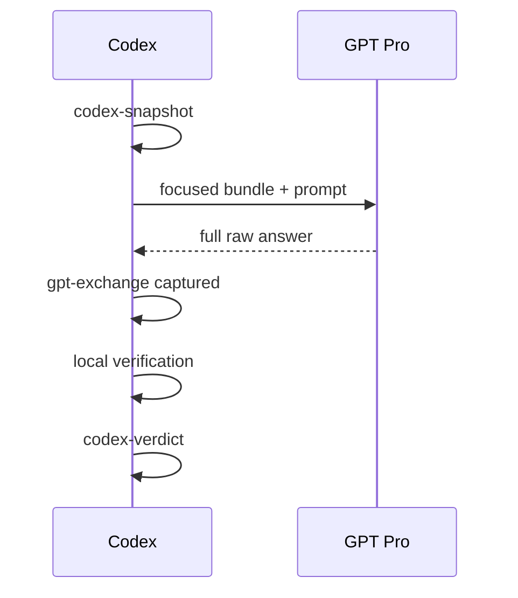

# Codex Pro Bridge

Codex Pro Bridge 把本地 Codex 工作与已登录 ChatGPT/GPT Pro 网页中的外部推理连接起来。

Codex 始终是本地事实源：选择证据、读取和修改代码、运行测试、验证结论。GPT Pro 只接收经过限定的证据包，并返回外部评审；bridge 会保存每次交接，但不会把外部回答直接当成事实。

## Skills

| Skill | 作用 |
| --- | --- |
| `gpt-pro-question-window` | 浏览器与持久化入口：上传、提问、保存原始回答，再记录 Codex 验证。 |
| `bundle-algorithm-context` | 构建带明确证据契约的、不可变的聚焦 bundle。 |
| `gpt-pro-research-algorithm-reviewer` | 深度算法、管线、实验和研究评审。 |
| `gpt-pro-paper-brainstormer` | 论文 claim、novelty、reviewer objection 和实验故事评审。 |
| `experiment-plan-generator` | 把评审转成最小实验矩阵和决策规则。 |
| `implementation-consistency-checker` | 核对方案、代码、配置、命令、数据切分、评测、日志和指标。 |
| `gpt-pro-algorithm-pipeline` | 编排完整的证据、评审、验证、实验和实现闭环。 |

## 机制

一个任务只暴露一个必填的 `bridge-thread-id`。Codex 和 GPT Pro session ID 默认自动派生；只有复用已有兼容 session 时才需要显式指定。



JSONL 是唯一的 append-only 时间线。Markdown timeline、index 和 sequence diagram 都是可重新生成的视图。不可变 notes snapshot、bundle、GPT Pro turn 和 Codex verdict 通过仓库相对路径与 SHA-256 绑定。

构建 bundle 只是本地中间步骤，不进入任务时间线。真正发送的 bundle 会在对应 `gpt-exchange` 中记录，因此 smoke test 和废弃草稿不会污染主线。

完整状态契约和命令见 [bridge_protocol.md](codex-pro-bridge-skills/.agents/skills/gpt-pro-question-window/references/bridge_protocol.md)。

## 多轮交互

第一轮可以发送聚焦代码、配置、文档和结果。后续通常只发送最新 Codex notes 和精简事件窗口；只有文件变化或 GPT Pro 必须重新检查实现时才补文件。

GPT Pro 完成回答后先立即保存原文；Codex 的本地验证稍后单独保存成 verdict。不要修改原始回答，让后续结论看起来像当时就存在。

## 安装

浏览器前置条件：

1. 在 Chrome 中下载安装并启用 Codex 扩展；在当前环境从 Chrome 应用商店下载时，需要临时使用美区网络节点。
2. 打开 `chrome://extensions/`，进入 Codex 扩展的**详情**，开启 **Allow access to file URLs（允许访问文件网址）**。

如果没有开启该权限，Chrome 即使能打开上传入口，也可能无法把本地 bundle 添加为附件。

全局安装：

```bash
./codex-pro-bridge-skills/install.sh --global
```

安装到指定仓库：

```bash
./codex-pro-bridge-skills/install.sh --repo /path/to/repo
```

安装器只替换这套包管理的 7 个 skills 和隐藏共享运行时，会清理这些目录里的 stale 文件，但不会删除其他全局 skills。

安装到仓库时还会把 `.agents/` 和 `.codex/` 写入该仓库本地的 `.git/info/exclude`，避免本地 skills 和 bridge 产物进入提交。

如果当前 Codex session 没有识别新版，请重启 Codex 或新开 session。

## 使用

普通问题：

```text
Use $gpt-pro-question-window.
Use bridge thread <repo>-<date>-<task> and ask GPT Pro:
<问题>
Capture the raw answer, verify it locally, and record a separate Codex verdict.
```

完整算法/研究闭环：

```text
Use $gpt-pro-algorithm-pipeline.
Run the Codex -> GPT Pro -> Codex loop for:
<任务>
Keep one bridge thread, send only scoped evidence, and do not act on unverified claims.
```

## 安全规则

- 默认只发送仓库内文件；外部文件必须显式确认，并使用匿名 archive name。
- 缺失 include、artifact 覆盖、session 改绑和高置信度 secret 模式都会直接失败。
- 不上传 env、凭证、cookie、key、数据库、原始私有数据或无关产物。
- 上传 manifest 只写安全 repo label，不暴露本地绝对路径。
- GPT Pro 网页步骤使用已登录 Chrome；Codex 扩展必须已安装、启用，并保持 **Allow access to file URLs（允许访问文件网址）** 开启。Computer Use 只处理 Chrome 无法控制的 UI 边界。
- 遇到登录、密码、2FA、CAPTCHA、rate limit、abuse warning 或账号安全提示时停止。
- 除非用户明确决定，否则不要公开 `.codex/` bridge 产物。

## 验证

```bash
cd codex-pro-bridge-skills
python3 -m unittest discover -s tests -v
python3 tests/validate_skills.py
```

测试和校验只依赖 Python 标准库。
