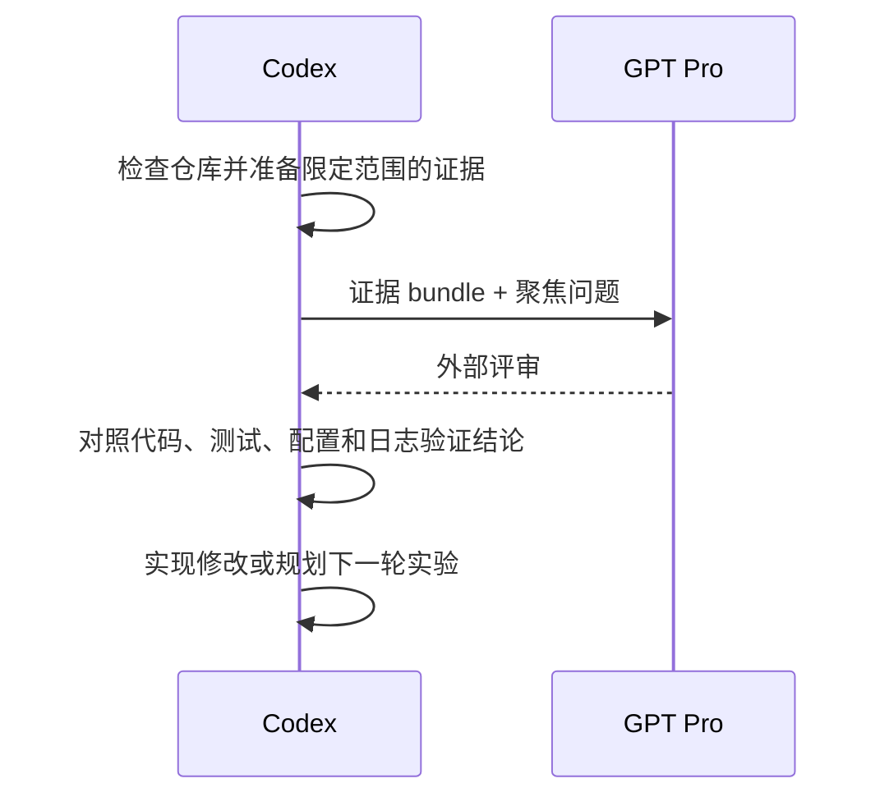

# Codex Pro Bridge

[English](README.md)

## Introduction

Codex 擅长在仓库内部工作：理解代码、修改文件、运行测试并验证行为。强推理模型更适合另一类工作：算法评审、研究批判、实验设计和长链路分析。

真正困难的是如何把这两种能力连接起来。

### 问题

外部模型不会自动知道当前仓库状态、实际实现、本地实验，以及 Codex 已经做过的判断。

常见做法是手工复制粘贴，但这很快会变成“上下文太少”和“上下文太多”之间的选择。

上下文太少时，reviewer 会对没有看过的代码给出自信建议。上下文太多时，材料噪声大、更新困难，也更容易混入无关或敏感内容。

### 工作流痛点

即使第一轮交接成功，多轮协作仍然很脆弱：

- 回答可能已经不再对应它评审时的代码 snapshot。
- Follow-up 不断重复发送相同文件。
- 外部建议和本地验证事实逐渐混在一起。
- 最终实现丢失了当时的推理、证据和决策过程。

缺少的不是另一个聊天窗口，而是本地执行与外部推理之间可复现的交接方式。

### 核心思路

Codex Pro Bridge 把这次交接变成一个任务工作流：

1. Codex 围绕一个具体决策选择必要证据。
2. GPT Pro 只评审限定范围内的证据。
3. Codex 回到仓库验证评审结论，只执行有本地依据的建议。



Codex 始终是事实源。GPT Pro 是外部 reviewer，不负责直接修改仓库，也不负责最终验证。

## 工作方式

每个任务使用一个 bridge thread，使证据、外部评审、本地 verdict、实现和后续 follow-up 保持在同一条任务链上。

Bridge 会把三件事分开处理：

- **证据构建：**只准备足以支持当前决策的最小材料。
- **外部推理：**围绕准确的证据提出聚焦问题。
- **本地验证：**在修改代码或相信结果前，检查每一条可执行结论。

### 证据模式

| 模式 | 适用场景 | 仓库源码 |
| --- | --- | --- |
| `auto` | 第一轮、实现相关评审 | 选择 focus，补保守的本地依赖，再增加相关广度 |
| `explicit` | 聚焦 follow-up | 只重新发送需要评审的文件 |
| `none` | 只需要推理的 follow-up | 复用当前 notes 和任务上下文，不重新发送源码 |

Auto 模式会跟随 JavaScript/TypeScript 和 Python 中可以确定为本地的相对 import，也支持 `.mjs`、`.cjs`、`.mts`、`.cts` 等现代 Node 源码与测试文件。

Follow-up 通常只复用当前 Codex notes 和精简任务历史。只有文件发生变化，或者 reviewer 必须重新检查实现时，才再次发送源码。

## 适用场景

当一个决策值得增加一次独立推理评审时，可以使用 Codex Pro Bridge：

- 评审算法、训练管线、reward 设计或评测方法。
- 压测研究 claim、论文 framing、novelty 论证或 reviewer story。
- 把方案转成 baseline、ablation、metric 和决策规则。
- 检查代码、配置、数据切分、命令、日志和报告结果是否一致。
- 让复杂评审跨越多轮，同时保留证据和决策来源。

对于小型本地 bug、格式修改或直接实现任务，Codex 通常应该直接在仓库内完成，不需要使用 bridge。

## 快速开始

### 安装

全局安装：

```bash
./codex-pro-bridge-skills/install.sh --global
```

安装到指定仓库：

```bash
./codex-pro-bridge-skills/install.sh --repo /path/to/repo
```

Bridge 使用 Codex 可访问的已登录 Chrome session。外部评审开始时，选中的 skill 会自行检查浏览器前置条件。

如果已有 Codex task 没有发现更新后的 skills，请重启 Codex 或新建 task。

### 提一个普通问题

```text
Use $gpt-pro-question-window.
Use bridge thread <repo>-<date>-<task> and ask GPT Pro:
<问题>
Capture the raw answer, verify it locally,
and record a separate Codex verdict.
```

### 运行完整算法或研究闭环

```text
Use $gpt-pro-algorithm-pipeline.
Run the Codex -> GPT Pro -> Codex loop for:
<任务>
Keep one bridge thread, send only scoped evidence,
and implement only locally verified changes.
```

更多示例见 [examples/usage_prompts.md](codex-pro-bridge-skills/examples/usage_prompts.md)。

## Skills

| Skill | 作用 |
| --- | --- |
| `gpt-pro-question-window` | 提普通问题或继续已有外部评审 |
| `bundle-algorithm-context` | 为需要源码的评审构建限定范围的证据包 |
| `gpt-pro-research-algorithm-reviewer` | 评审算法、管线、实验和研究 claim |
| `gpt-pro-paper-brainstormer` | 推进论文 framing、novelty、反对意见和实验故事 |
| `experiment-plan-generator` | 把想法或评审转成实验矩阵 |
| `implementation-consistency-checker` | 检查方案、代码、配置、数据、评测和结果的一致性 |
| `gpt-pro-algorithm-pipeline` | 运行完整的证据、评审、验证、实验和实现闭环 |

不需要外部推理时，直接在本地使用 `$experiment-plan-generator` 和 `$implementation-consistency-checker`。

## 开发验证

```bash
cd codex-pro-bridge-skills
python3 -m unittest discover -s tests -v
python3 tests/validate_skills.py
```

## 延伸文档

- [工作流概览](codex-pro-bridge-skills/docs/WORKFLOW.md)
- [Canonical bridge protocol](codex-pro-bridge-skills/.agents/skills/gpt-pro-question-window/references/bridge_protocol.md)
- [Evidence bundle schema](codex-pro-bridge-skills/.agents/skills/bundle-algorithm-context/references/bundle_schema.md)
- [AGENTS.md 集成片段](codex-pro-bridge-skills/docs/AGENTS_APPEND_SNIPPET.md)
