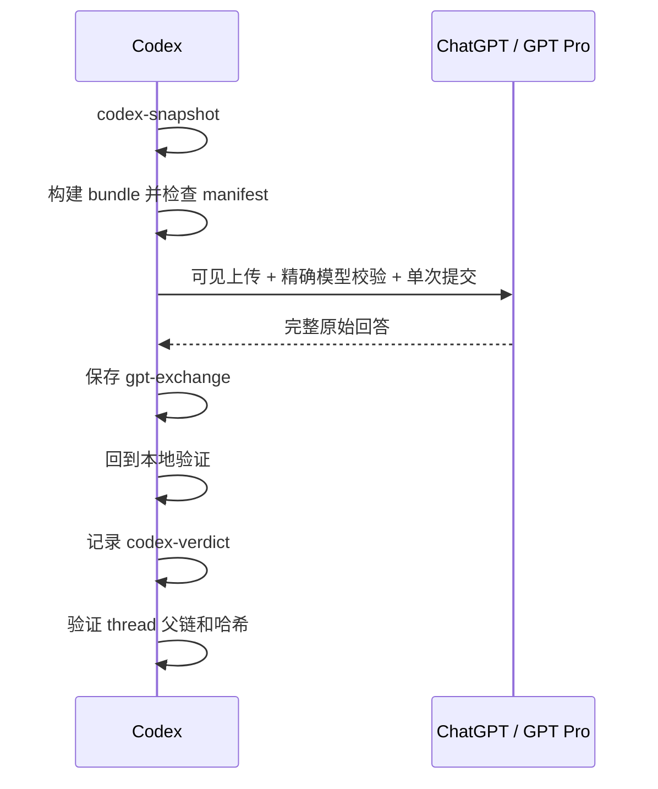

# Codex Pro Bridge

[English](README.md)

Codex Pro Bridge 是一套受监督工作流：把限定范围的本地证据发送到已登录的 ChatGPT 对话，保存原始回答，再回到仓库验证每一条可执行结论。

Codex 始终是事实源。Bridge 不会把仓库控制权交给网页模型，也不会把外部回答直接当成已经验证的实现建议。

## 它能保证什么

- 每个任务只有一个稳定的 `bridge-thread-id`。
- Codex snapshot、实际发送的 bundle、原始 GPT exchange 和 Codex verdict 都不可变。
- Artifact 使用仓库相对路径和 SHA-256 绑定。
- 显式证据默认 fail-closed。
- 浏览器提交前核对精确可见模型和附件。
- 实现或结果 sign-off 前必须回到本地验证。
- 交付前验证父链、artifact 哈希和 bundle 哈希。

## 它不能保证什么

- 可见的 `Pro` 标签只能证明 UI 选项，不能证明后端实际模型身份。
- 自动取证是保守选择，不是完整的 whole-program 依赖分析。
- Bridge 不是无人值守浏览器服务；登录、CAPTCHA、rate limit 和 UI 变化仍需人工监督。
- GPT 输出在 Codex 用本地代码、测试、配置、数据或日志验证前都只是建议。

## 快速开始

### 1. 准备 Chrome

安装并启用 Codex Chrome 扩展。打开 `chrome://extensions/`，进入扩展的**详情**，开启 **Allow access to file URLs（允许访问文件网址）**。

没有这个权限时，Chrome 可能能打开上传菜单，却无法添加本地 bundle。

### 2. 安装 skills

全局安装：

```bash
./codex-pro-bridge-skills/install.sh --global
```

安装到指定仓库：

```bash
./codex-pro-bridge-skills/install.sh --repo /path/to/repo
```

Repo-local 安装会把 `.agents/` 和 `.codex/` 加入该仓库本地的 `.git/info/exclude`，不会修改已跟踪的 `.gitignore`。

如果已有 Codex task 没有发现更新后的 skills，请重启 Codex 或新建 task。

### 3. 让 Codex 执行 bridge 任务

普通问题：

```text
Use $gpt-pro-question-window.
Use bridge thread <repo>-<date>-<task> and ask GPT Pro:
<问题>
Require the exact visible Pro selection, capture the raw answer,
verify it locally, and record a separate Codex verdict.
```

完整算法或研究闭环：

```text
Use $gpt-pro-algorithm-pipeline.
Run the Codex -> GPT Pro -> Codex loop for:
<任务>
Keep one bridge thread, send only scoped evidence,
and implement only locally verified changes.
```

更多示例见 [examples/usage_prompts.md](codex-pro-bridge-skills/examples/usage_prompts.md)。

## 工作流

每一轮外部评审都遵循相同生命周期：



Bundle 草稿不进入时间线。只有实际发送的 bundle 才会绑定到对应的 `gpt-exchange`。

原始回答和 Codex verdict 始终分开保存。后续验证不会修改外部回答，让它看起来像当时就已经得到验证。

## 证据模式

| 模式 | 适用场景 | 仓库源码 |
| --- | --- | --- |
| `auto` | 第一轮、实现相关评审 | 如果提供了显式 focus，先保证它们；再补保守的本地依赖闭包和相关广度 |
| `explicit` | 聚焦 follow-up | 只发送点名文件；缺失、被过滤或超过预算时默认失败 |
| `none` | 只需要推理的 follow-up | 不发送仓库源码，只带当前 notes 和精简 thread context |

Auto 模式会跟随 JavaScript/TypeScript 和 Python 中可以确定为本地的相对 import，也支持 `.mjs`、`.cjs`、`.mts`、`.cts` 等现代 Node 源码与测试文件。

Auto 模式会记录每个文件的入选原因。必需依赖闭包超过 `--max-files` 时直接失败，不会静默截断证据。

只有在检查并接受每个证据缺口后，才使用 `--allow-incomplete-includes` 或 `--allow-incomplete-auto-context`。

## 浏览器交互

使用 ChatGPT 可见的附件按钮和上传菜单项。不要直接点击 `#upload-files` 之类的隐藏 input。

点击发送前，核对精确可见模型标签和附件名：

下面的命令假设使用 repo-local 安装。全局安装时，把 `.agents/skills` 替换为 `${CODEX_HOME:-$HOME/.codex}/skills`。

```bash
python3 .agents/skills/gpt-pro-question-window/scripts/check_browser_preflight.py \
  --requested-model Pro \
  --selected-ui-label '<精确可见标签>' \
  --bundle /absolute/path/to/bundle.zip \
  --attachment-name '<可见文件名>' \
  --upload-control visible-menu
```

只有 preflight 成功后才提交。`极高`、包含 “Pro” 的账号名和精确的 `Pro` 模型选项是三种不同观察。

Preflight 会把 UI 观察显式化并 fail-closed，但不能独立证明后端模型身份。

只提交一次。只要生成状态仍然可见，就继续等待并汇报进度，不要重复发送。遇到停滞或保护状态时保存诊断信息并停止。

如果回答已经在 mismatch 或 unverified 模型状态下产生，仍然保存原文并如实记录 provenance，不要把它重新标记为 Pro。

## 状态与验真

Bridge 状态保存在：

```text
.codex/codex-pro-bridge/
  threads/             # canonical JSONL ledger 和派生 Markdown 视图
  codex-sessions/      # 可变 notes 和不可变 snapshots
  gpt-pro-sessions/    # 原始 exchanges 和独立 Codex verdicts
  bundles/             # 不可变证据包
```

JSONL ledger 是 canonical 状态；Markdown timeline、index 和 sequence diagram 都是派生视图。

每次 follow-up 或最终交付前验证 thread：

```bash
python3 .agents/skills/gpt-pro-question-window/scripts/verify_bridge_thread.py \
  --repo . \
  --bridge-thread-id <thread-id> \
  --require-complete-rounds
```

Verifier 会检查事件顺序、父链、事件角色、artifact 路径、artifact 哈希、bundle 哈希和未完成的最后一轮。

## Skills

| Skill | 作用 |
| --- | --- |
| `gpt-pro-question-window` | 浏览器控制、精确 preflight、原始回答保存、持久化和 thread 验真 |
| `bundle-algorithm-context` | 带明确证据契约的、限定范围的不可变 bundle |
| `gpt-pro-research-algorithm-reviewer` | 算法、管线、实验和研究评审 |
| `gpt-pro-paper-brainstormer` | Claim、novelty、reviewer objection 和实验故事 |
| `experiment-plan-generator` | 最小实验矩阵和决策规则 |
| `implementation-consistency-checker` | 方案、代码、配置、数据、评测、日志和指标一致性 |
| `gpt-pro-algorithm-pipeline` | 完整的证据、评审、验证、实验和实现闭环 |

不需要外部推理时，直接在本地使用 `$experiment-plan-generator` 和 `$implementation-consistency-checker`。

## 安全规则

- 默认只发送仓库内证据。
- 检查并确认每个外部 include；外部 archive name 会匿名化。
- 排除 env、凭证、cookie、key、数据库、原始私有数据、vendor tree 和大型无关产物。
- 检测到高置信度 secret 模式时失败，除非已经人工检查对应文件。
- 不允许把已有 session 移动到另一个 bridge thread 或 ChatGPT conversation URL。
- 遇到登录、密码、2FA、CAPTCHA、rate limit、abuse warning 或账号安全提示时停止。
- 除非用户明确选择，否则不公开 `.codex/` bridge 产物。

## 开发与验证

```bash
cd codex-pro-bridge-skills
python3 -m unittest discover -s tests -v
python3 tests/validate_skills.py
```

仓库内测试和校验只依赖 Python 标准库。

## 延伸文档

- [工作流概览](codex-pro-bridge-skills/docs/WORKFLOW.md)
- [Canonical bridge protocol](codex-pro-bridge-skills/.agents/skills/gpt-pro-question-window/references/bridge_protocol.md)
- [Evidence bundle schema](codex-pro-bridge-skills/.agents/skills/bundle-algorithm-context/references/bundle_schema.md)
- [AGENTS.md 集成片段](codex-pro-bridge-skills/docs/AGENTS_APPEND_SNIPPET.md)
