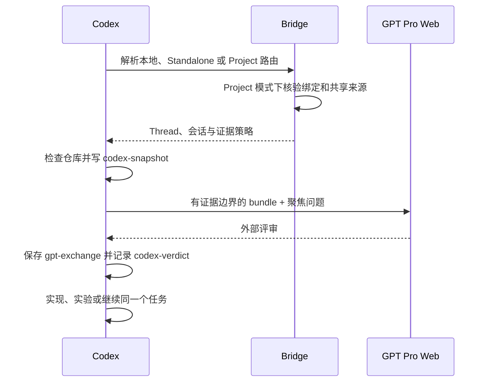
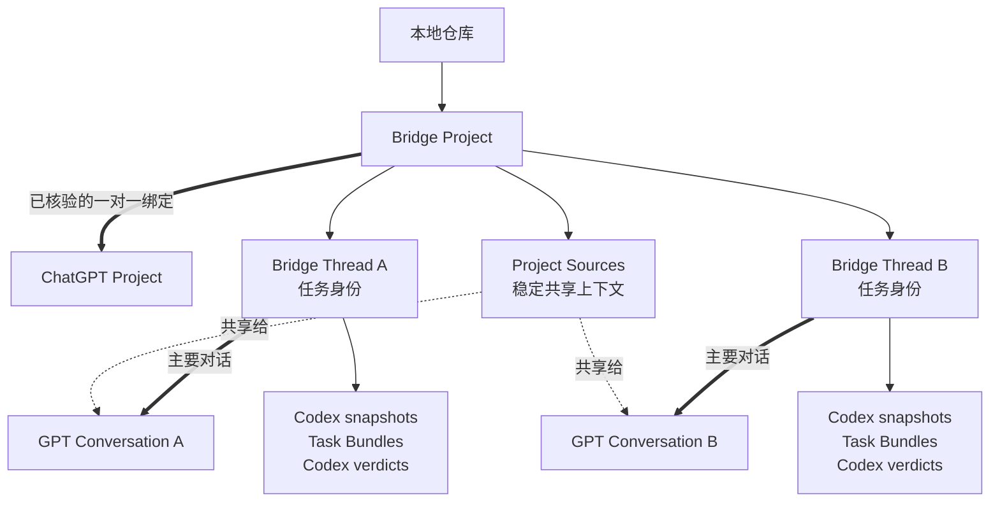

# Codex Pro Bridge

[English](README.md)

## Introduction

Codex Pro Bridge 面向在算法设计、研究推理和工程实现之间来回切换的工作。

Codex 和 GPT Pro 都有用，但它们适合待的位置和工作的节奏并不一样。

Codex 更适合留在本地仓库里。它能读文件、改代码、跑测试、看日志，并检查一个方案是否真的符合当前实现。

GPT Pro 更适合慢一点的外部推理：质疑算法、梳理 failure mode、设计 ablation、规划实验、组织论文 framing，或者尝试从反面推翻一个想法。

真正脆弱的是两者之间的交接。

### 问题

没有桥接层时，流程很容易变成在仓库、Codex 和浏览器之间来回切换，再靠手工复制粘贴把它们连在一起。

外部模型不会自动知道当前仓库状态、实际实现、本地实验，以及 Codex 已经做过的判断。

补充这些信息很快会变成“上下文太少”和“上下文太多”之间的选择。

上下文太少时，reviewer 会对没有看过的代码给出自信建议。上下文太多时，材料噪声大、更新困难，也更容易混入无关或敏感内容。

### 工作流痛点

这次交接会产生几类损失：

- **注意力损失：**频繁在仓库、Codex 和浏览器之间切换。
- **结构损失：**prompt、文件、假设、追问和决策在工具间复制时逐渐散掉。
- **可复现性损失：**之后很难知道 GPT Pro 当时到底看到了哪些证据。
- **状态漂移：**Web 对话继续往前走，但真实仓库、实验和实现已经发生变化。
- **落地损失：**一个不错的算法或研究想法没有回到测试、配置、日志和真实代码里。

在单轮里，这些只是流程摩擦；经过多轮后，它们会让评审难以复用、审计和实现。

缺少的不是另一个聊天窗口，而是本地执行与外部推理之间可复现的交接方式。

### 核心思路

Codex Pro Bridge 不是 API client，也不是让 GPT Pro 直接修改本地文件。

它是由 Codex skills 和辅助脚本组成的本地工作流层。它把一次 GPT Pro Web 评审变成本地工程材料：可以复用，可以追溯，也能重新接回真实仓库。

这条工作流是：

1. Codex 先把请求路由到本地执行、独立评审或当前仓库绑定的 ChatGPT Project。
2. Codex 围绕一个具体任务写本地 notes。
3. Codex 生成带明确证据边界的 bundle。
4. GPT Pro 在正确的 Web 对话中评审限定范围内的材料。
5. Codex 保存完整回答，做本地摘要，并验证可执行结论。
6. 同一个任务继续进入实现、实验或下一轮聚焦评审。



目标是让这条链路可复用、可审计、可实现。Codex 始终是事实源，GPT Pro 始终是外部 reviewer。

## 工作方式

每个任务使用一个 bridge thread，使证据、外部评审、本地 verdict、实现和后续 follow-up 保持在同一条任务链上。

### 执行范围

同一套任务协议支持三种执行范围：

| 范围 | 结构 | 适合场景 |
| --- | --- | --- |
| `local_only` | Codex 直接完成 | 不需要外部评审 |
| `standalone` | 一条 Bridge Thread 对应一个 GPT 对话 | 小项目、一次性评审 |
| `project` | 一个仓库 Project 下包含多条任务 Thread | 有共享资料、多会话的长期科研项目 |

### Project 模式

Project 模式是在原有 Bridge Thread 工作流上增加的一层可选组织结构。当一个
仓库里同时存在多项长期任务、多个 GPT 对话，以及一批需要跨对话共享的背景资料
时，可以使用 Project 模式；小项目仍然可以继续使用 standalone。



这层关系刻意保持简单：一个本地根目录最多有一个 Bridge Project，一个 Bridge
Project 最多绑定一个当前 ChatGPT Project。Project 名称只是显示信息；只有在
可见的 Project URL、ID、当前账号和 workspace 都核验正确后，自动 Project
路由才会生效。

Project 模式目前提供以下能力：

| 能力 | 具体行为 |
| --- | --- |
| 已核验的 Project 绑定 | 绑定已有 ChatGPT Project 或新建一个 Project，并在使用前核验可见身份 |
| 自动路由 | 在 `local_only`、`standalone` 和 `project` 之间选择；绑定或共享来源异常时暂停提交 |
| 共享 Project Sources | 将 project brief、术语表、PRD、长期决策等稳定资料共享给 Project 下的多个对话 |
| 安全更新来源 | 根据完整远端清单制定计划，检查敏感内容和容量，只修改 Bridge 自己管理的版本 |
| 多任务组织 | 独立交付物使用独立 Bridge Thread 和 GPT 对话，同一任务的后续轮次复用原任务 |
| Project 生命周期 | 记录任务状态和依赖；挂入旧 standalone Thread；支持归档、恢复、解绑和丢失绑定恢复，不删除远端内容 |
| 本地审计记录 | 用本地追加式状态保存绑定、来源、任务和核验事件，不再依赖人脑记住浏览器状态 |

Project Sources 和 Task Bundles 负责不同的事情。稳定的项目背景通过 ChatGPT
Project 在多个对话间共享；diff、日志、局部代码、实验结果和单轮问题仍放在
不可变的 Task Bundle 中，因此每次评审依然有准确的证据边界。

来源所有权采用保守策略。远端原有的文件、instructions 和 conversations 都按
用户管理内容处理。`read_only` 不修改远端来源；`append_only` 添加新的 Bridge
版本并保留旧版本；`managed` 只有在新版本已经可见后，才允许替换 Bridge 自己
管理的旧版本。任何模式都不允许自动删除用户管理的内容。

已经绑定到当前 Bridge Thread 的对话会继续复用。远端 Project 中原有但尚未
纳入 Bridge 的对话仍然属于外部内容，只有用户明确采用后才会绑定；Bridge 不会
在无关对话之间静默猜测，也不会偷偷改绑已经保存的对话 URL。

Bridge Thread 仍然是任务身份，因此 Project 模式不会再重复增加一层 Workstream。
旧的 standalone 历史可以随后挂入 Project，而且不需要改写旧事件。本地 Bridge
状态会保存 ID、摘要、状态、经过核验的观察，以及用户明确纳入当前任务的评审
材料；它不会保存浏览器 cookie、access token 或无关的网页私人响应。

无论使用哪种范围，Bridge 都会把三件事分开处理：

- **证据构建：**只准备足以支持当前决策的最小材料。
- **外部推理：**围绕准确的证据提出聚焦问题。
- **本地验证：**在修改代码或相信结果前，检查每一条可执行结论。

### 证据模式

| 模式 | 适用场景 | 仓库源码 |
| --- | --- | --- |
| `auto` | 第一轮、实现相关评审 | 选择 focus，补保守的本地依赖，再增加相关广度 |
| `explicit` | 聚焦 follow-up | 只重新发送需要评审的文件 |
| `none` | 只需要推理的 follow-up | 复用当前 notes 和任务上下文，不重新发送源码 |

Auto 模式会跟随 JavaScript/TypeScript 和 Python 中可以确定为本地的相对 import，也支持 `.mjs`、`.cjs`、`.mts`、`.cts` 等现代 Node 源码与测试文件。

Follow-up 通常只复用当前 Codex notes 和精简任务历史。只有文件发生变化，或者 reviewer 必须重新检查实现时，才再次发送源码。

## 适用场景

当一个决策值得增加一次独立推理评审时，可以使用 Codex Pro Bridge：

- 评审算法、训练管线、reward 设计或评测方法。
- 压测研究 claim、论文 framing、novelty 论证或 reviewer story。
- 把方案转成 baseline、ablation、metric 和决策规则。
- 检查代码、配置、数据切分、命令、日志和报告结果是否一致。
- 让复杂评审跨越多轮，同时保留证据和决策来源。

对于小型本地 bug、格式修改或直接实现任务，Codex 通常应该直接在仓库内完成，不需要使用 bridge。

## 快速开始

### 使用前准备

第一次使用 Bridge 前：

1. 使用美区网络，从 Chrome Web Store 安装并启用 [Codex 扩展](https://chromewebstore.google.com/detail/codex/hehggadaopoacecdllhhajmbjkdcmajg)。
2. 打开 `chrome://extensions/?id=hehggadaopoacecdllhhajmbjkdcmajg`，进入扩展的 **Details**，开启 **Allow access to file URLs**。
3. 在 Codex 将使用的同一个 Chrome profile 中登录 ChatGPT。

以上只需设置一次。每次开始外部评审前，选中的 skill 会再次检查这些前置条件。

### 安装

全局安装：

```bash
./codex-pro-bridge-skills/install.sh --global
```

安装到指定仓库：

```bash
./codex-pro-bridge-skills/install.sh --repo /path/to/repo
```

如果已有 Codex task 没有发现更新后的 skills，请重启 Codex 或新建 task。

### 提一个普通问题

```text
Use $gpt-pro-question-window.
Route this task automatically and ask GPT Pro:
<问题>
Capture the raw answer, verify it locally,
and record a separate Codex verdict.
```

这仍然保留原来的 CLI 使用感：skill 会自动选择 Thread 和会话，只有 Project
需要创建、绑定或修复时才要求人工确认。

### 绑定长期 Project

```text
Use $gpt-pro-project-workspace.
把这个仓库绑定到我已有的 ChatGPT Project，
核验可见的 Project 与账号身份，
并规划稳定 Project Sources，不删除用户自己维护的文件。
```

这通常只需要设置一次。绑定生效后，普通外部问题仍然从
`$gpt-pro-question-window` 或其他专用 review skill 进入；当当前仓库和任务已经
属于这个 Project 时，router 会自动选择 Project 模式。

### 维护已绑定的 Project

```text
Use $gpt-pro-project-workspace.
检查当前 binding、tasks 和 Project Sources。
从以下文件刷新稳定共享来源：
<文件>
先预览计划，不要删除用户管理的内容。
```

同一个 skill 也可以更新任务信息、处理缺失或过期的来源、归档或恢复本地 Bridge
Project，以及在远端 Project 再次可见后修复原绑定。

### 运行完整算法或研究闭环

```text
Use $gpt-pro-algorithm-pipeline.
Run the Codex -> GPT Pro -> Codex loop for:
<任务>
Keep one bridge thread, send only scoped evidence,
and implement only locally verified changes.
```

更多示例见 [examples/usage_prompts.md](codex-pro-bridge-skills/examples/usage_prompts.md)。

## Skills

| Skill | 作用 |
| --- | --- |
| `gpt-pro-project-workspace` | 绑定、路由、同步、查看和修复 Project 工作区 |
| `gpt-pro-question-window` | 提普通问题或继续已有外部评审 |
| `bundle-algorithm-context` | 为需要源码的评审构建限定范围的证据包 |
| `gpt-pro-research-algorithm-reviewer` | 评审算法、管线、实验和研究 claim |
| `gpt-pro-paper-brainstormer` | 推进论文 framing、novelty、反对意见和实验故事 |
| `experiment-plan-generator` | 把想法或评审转成实验矩阵 |
| `implementation-consistency-checker` | 检查方案、代码、配置、数据、评测和结果的一致性 |
| `gpt-pro-algorithm-pipeline` | 运行完整的证据、评审、验证、实验和实现闭环 |

不需要外部推理时，直接在本地使用 `$experiment-plan-generator` 和 `$implementation-consistency-checker`。

## 延伸文档

- [工作流概览](codex-pro-bridge-skills/docs/WORKFLOW.md)
- [Canonical bridge protocol](codex-pro-bridge-skills/.agents/skills/gpt-pro-question-window/references/bridge_protocol.md)
- [Bridge Project protocol](codex-pro-bridge-skills/.agents/skills/gpt-pro-project-workspace/references/project_protocol.md)
- [Evidence bundle schema](codex-pro-bridge-skills/.agents/skills/bundle-algorithm-context/references/bundle_schema.md)
- [AGENTS.md 集成片段](codex-pro-bridge-skills/docs/AGENTS_APPEND_SNIPPET.md)

## Star History

<a href="https://www.star-history.com/?repos=WILLOSCAR%2Fcodex-pro-bridge&type=date&legend=top-left">
  <picture>
    <source media="(prefers-color-scheme: dark)" srcset="assets/star-history/star-history-dark.svg">
    
  </picture>
</a>

## 鸣谢

感谢 [Linux.do](https://linux.do/) 社区提供的讨论、反馈与支持。
