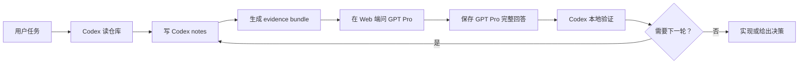

# Codex Pro Bridge

Codex Pro Bridge 是一组 Codex skills，用来连接本地 Codex 工作流和 Web 端 GPT Pro，同时让仓库继续作为最终事实来源。

它面向算法、研究和工程实现之间来回切换的场景。Codex 和 GPT Pro 都有用，但它们适合做的事情不一样。

Codex 更适合待在本地仓库里。它能读文件、改代码、跑测试、看日志，并检查一个方案是否真的符合当前实现。

GPT Pro 更适合慢一点的外部推理。比如算法质疑、failure mode 梳理、ablation 设计、实验计划、论文 framing，以及对一个想法做逆向审视。

脆弱的地方在交接。没有桥接层时，流程很容易变成在仓库、Codex 和浏览器之间来回切换，再手动复制粘贴。上下文会散，决策会丢，Web 对话也可能逐渐偏离真实代码。

这个包的目标是让这条链路变得可复用、可审计、可实现：Codex 先写本地 notes，再生成有证据边界的 bundle，通过 GPT Pro 网页做评审，回来保存完整回答，做本地摘要和验证，然后更新同一个任务时间线，进入下一轮。

## 这是什么

Codex Pro Bridge 不是 API client，也不是让 GPT Pro 直接改本地文件。

它是一个本地工作流层，由 Codex skills 和辅助脚本组成。它把一次 GPT Pro Web 对话变成本地工程材料：可以复用，可以追溯，也能接回真实代码。

## 它解决什么问题

这个桥主要减少几类损失：

- 注意力损失：频繁在仓库、Codex 和浏览器之间切换。
- 结构损失：prompt、文件、假设、追问和决策靠复制粘贴传递后容易散掉。
- 可复现性损失：之后很难知道 GPT Pro 当时到底看到了什么。
- 状态漂移：Web 对话继续往前走，但真实仓库已经变了。
- 落地损失：一个不错的算法想法没有回到测试、配置、日志和实现里。

## 包含的 skills

这些 skills 位于 `codex-pro-bridge-skills/.agents/skills`。

| Skill | 用途 |
| --- | --- |
| `gpt-pro-question-window` | 打开或复用已登录的 GPT Pro 网页会话，提问、可选附加上下文，并保存回答。 |
| `bundle-algorithm-context` | 从代码、配置、文档、日志和笔记中生成精简的直接证据包，同时排除不安全或过大的文件。 |
| `gpt-pro-research-algorithm-reviewer` | 请求 GPT Pro 做深度算法/研究评审，包括假设、失败模式、评估、消融、novelty 和 go/no-go 判断。 |
| `gpt-pro-paper-brainstormer` | 打磨论文叙事、claim、reviewer objection、novelty 和实验故事线。 |
| `experiment-plan-generator` | 把评审结果转成优先级实验矩阵和可执行 checklist。 |
| `implementation-consistency-checker` | 检查方案、代码、配置、数据划分、评测脚本和日志是否一致。 |
| `gpt-pro-algorithm-pipeline` | 串起完整闭环：打包上下文、问 GPT Pro、本地验证、规划实验、落地安全的下一步。 |

## 核心模型

这个 workflow 会维护一个任务级 thread，以及两端各自的 session。

| 对象 | 含义 |
| --- | --- |
| Bridge thread | 一个任务的总时间线，串起 Codex 和 GPT Pro 的多轮交互。 |
| Codex session | Codex 侧的本地状态，包括 summary、最近原始对话、决策、验证和下一轮问题。 |
| GPT Pro session | 一个 GPT Pro 网页会话，以及复制回本地的编号 turn。 |
| Bundle | 某一轮发送给 GPT Pro 的证据包，通常是源码 zip 加一个简短 manifest。 |

同一个任务只用一个 `bridge-thread-id`。两端 session 从它派生：

```text
Bridge thread: <task>-<YYYYMMDD>-<short-topic>
Codex session: <bridge-thread-id>-codex
GPT Pro session: <bridge-thread-id>-gpt-pro
```

Bridge thread 是整条任务链路的主线。helper 不需要额外传递一张图，只需要复用同一个 `bridge-thread-id`。每次调用都会往这个 thread 追加结构化事件：`codex-update`、`bundle` 或 `gpt-pro-turn`。

Mermaid `gitGraph` 是从这个 append-only thread ledger 派生出来的视图。Codex 侧事件留在主线，GPT Pro turn 作为 GPT Pro 侧事件展示。Graph 可以随时从 thread 重新生成，所以它保持轻量，也不需要维护另一份状态。

## 工作流



关键握手是：

- 进入 GPT Pro 前：Codex 先把本地状态固化成 notes 和 bundle。
- GPT Pro 侧：只接收本轮 scoped bundle 或追问上下文。
- 回到 Codex 后：保存 GPT Pro 完整回答，写 summary，做本地验证，并记录 decision trail。
- 下一轮：复用同一个 bridge thread，但通常只发送 notes 和 session graph。

多轮时，第一轮可以带代码或配置证据。后续通常只带 Codex notes、精简 thread context 和 session graph。每一轮都会往同一个 bridge thread 追加一个事件，graph 从这条共享时间线生成。只有文件变了，或者 GPT Pro 确实需要重新看实现时，才补文件。

## 安装

### 全局安装到 Codex

```bash
mkdir -p ~/.codex/skills
cp -R codex-pro-bridge-skills/.agents/skills/* ~/.codex/skills/
```

如果 Codex 没有立刻识别新 skill，重启 Codex。

### 只安装到某个仓库

```bash
mkdir -p /path/to/repo/.agents
cp -R codex-pro-bridge-skills/.agents/skills /path/to/repo/.agents/
```

## 快速 prompt

普通 GPT Pro 问题：

```text
Use $gpt-pro-question-window.
Open a GPT Pro conversation and ask:
[问题]
Save the full answer as the next turn in the current GPT Pro session, then summarize the useful parts.
Use bridge thread <bridge-thread-id> for this task.
```

深度算法评审：

```text
Use $gpt-pro-research-algorithm-reviewer.
I want a deep algorithm review, not a normal code review.
Goal: [算法/管线/研究目标]
Focus files: [相关文件]
Current concern: [现在最不确定的点]
Return: diagnosis, failure modes, ablation plan, implementation checkpoints, and a go/no-go decision.
```

完整 Codex -> GPT Pro -> Codex 闭环：

```text
Use $gpt-pro-algorithm-pipeline.
Run the full Codex -> GPT Pro -> Codex algorithm review loop for:
[任务]
After GPT Pro responds, verify the claims against the repo, filter hallucinations, produce a minimal experiment plan, and implement only the safe next step.
```

## 安全边界

- 不上传 `.env`、凭据、cookie、私钥、token、数据库或完整用户数据。
- 打包脚本按路径和文件名排除明显的 secret、env、raw data、数据库、vendor 和大型产物。
- 普通源码、配置、文档和日志不会被脱敏改写；它们要么作为证据进入 bundle，要么被省略。
- 如果 ChatGPT 没有登录，让用户手动登录；不要输入密码或 2FA。
- 默认一个 GPT Pro conversation；必要时可以两到三个，但最多不超过三个。
- paste、upload、submit、copy 和 navigation 动作之间加入小幅变化的等待。
- 遇到 CAPTCHA、rate limit、abuse warning、异常登录或账号安全提示时停止。
- GPT Pro 的输出只当作外部评审，不当作事实来源。
- Codex 必须回到本地仓库验证建议，确认代码、配置、测试和日志一致后再改。
