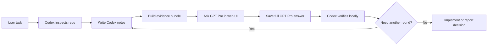

# Codex Pro Bridge Skills

A repo-ready Codex skills package for connecting local Codex work with GPT Pro in the ChatGPT web UI.

Codex stays close to the repository: reading code, editing files, running tests, checking configs, and verifying behavior. GPT Pro is useful for slower external reasoning: algorithm critique, failure modes, ablations, experiment design, paper framing, and adversarial review.

The bridge makes the handoff explicit. Codex writes local session notes, builds an evidence bundle, asks GPT Pro a scoped question, saves the full GPT Pro answer locally, verifies the claims against the repo, and updates the same task timeline before the next round.

## Included Skills

| Skill | Purpose |
| --- | --- |
| `gpt-pro-question-window` | Base bridge: open or reuse a signed-in ChatGPT/GPT Pro conversation, ask a normal question, optionally attach a bundle, and save the response. |
| `bundle-algorithm-context` | Build a compact direct-evidence bundle from code, configs, docs, logs, and notes while excluding unsafe or oversized files. |
| `gpt-pro-research-algorithm-reviewer` | Ask GPT Pro for deep algorithm, pipeline, or research review with hypothesis, baseline, data, reward/loss, eval, ablation, novelty, and go/no-go sections. |
| `gpt-pro-paper-brainstormer` | Ask GPT Pro to refine research framing, paper claims, novelty, reviewer objections, and experiment story. |
| `experiment-plan-generator` | Convert a review into a prioritized minimal experiment matrix and executable checklist. |
| `implementation-consistency-checker` | Make Codex verify that proposal, code, configs, data splits, eval scripts, and logs are consistent. |
| `gpt-pro-algorithm-pipeline` | Full end-to-end orchestrator: bundle, GPT Pro review, Codex verification, experiments, and implementation check. |

## Core Objects

Use one task-level bridge thread and two endpoint sessions:

```text
Bridge thread: <repo>-<date>-<task>
Codex session: <bridge-thread-id>-codex
GPT Pro session: <bridge-thread-id>-gpt-pro
```

The bridge thread is the task timeline. Helpers do not pass a separate graph around; they only reuse the same `bridge-thread-id`. Each helper call appends a structured event to that thread: `codex-update`, `bundle`, or `gpt-pro-turn`.

The Mermaid `gitGraph` is a view derived from that append-only thread ledger. Codex-side events stay on the main line, while GPT Pro turns are shown as GPT Pro-side events. The graph can be regenerated from the thread at any time, so it stays light and has no separate state to keep in sync.

Codex session notes are required by default. They should include the current goal, summary, inspected files, decisions, rejected ideas, verification notes, next GPT Pro question, and recent raw Codex turns when available. If raw history is not accessible, state that in the notes.

Each GPT Pro turn file should preserve the prompt, bundle path or pasted-context description, full GPT Pro answer, Codex summary, Codex verification notes, and decision trail.

## Workflow



Every boundary crossing is recorded. Codex makes local state explicit before asking GPT Pro, then saves and verifies GPT Pro's response before trusting it.

For multi-round work, the first GPT Pro round may include code or config evidence. Later rounds usually carry Codex notes, compact thread context, and the session graph. Each round appends one event to the same bridge thread, and the graph is generated from that shared timeline. Add files again only when they changed or GPT Pro needs to inspect them.

## Installation

### Repo-Level Install

Copy the `.agents/skills` directory into the root of the repository where you use Codex:

```bash
cp -R .agents/skills /path/to/your/repo/.agents/
```

Restart Codex if the new skills do not show up.

### Global Codex Install

Copy the individual skill folders into your user-level skills directory:

```bash
mkdir -p ~/.codex/skills
cp -R .agents/skills/* ~/.codex/skills/
```

## Quick Prompts

Normal GPT Pro question:

```text
Use $gpt-pro-question-window.
Open a new GPT Pro conversation and ask this question:
[question]
Save the full answer as the next turn in the current GPT Pro session, then summarize the useful parts for me.
Use bridge thread <bridge-thread-id> for this task.
```

Reuse a GPT Pro conversation:

```text
Use $gpt-pro-question-window.
Reuse GPT Pro session <gpt-pro-session-id> and ask:
[follow-up question]
```

Deep algorithm review:

```text
Use $gpt-pro-research-algorithm-reviewer.
I want a deep algorithm review, not a normal code review.
Goal: [algorithm/pipeline/research goal]
Focus files: [optional paths]
Current concern: [what feels uncertain]
Return: diagnosis, failure modes, ablation plan, implementation checkpoints, and go/no-go decision.
```

Full pipeline:

```text
Use $gpt-pro-algorithm-pipeline.
Run the full Codex -> GPT Pro -> Codex algorithm review loop for this task:
[task]
After GPT Pro responds, do not blindly follow it. Re-check the repo, filter hallucinations, produce a minimal experiment plan, and implement only the safe next step.
```

## Safety Rules

- Do not upload `.env`, credentials, cookies, private keys, tokens, databases, or full user data dumps.
- The bundle builder excludes obvious secret, env, raw-data, database, vendor, and large artifact files by path and name.
- Normal source, config, doc, and log contents are not rewritten. They are either included as evidence or omitted.
- If ChatGPT is not signed in, pause and ask the user to sign in manually. Do not enter passwords or 2FA codes.
- Prefer the signed-in Chrome integration for ChatGPT. Use Computer Use only when file uploaders, modal dialogs, or non-DOM UI make browser automation unreliable.
- Prefer one GPT Pro conversation. Use two or three only when useful, and never exceed three concurrent conversations.
- Add small varied waits between paste, upload, submit, copy, and navigation actions.
- Stop for CAPTCHA, rate-limit, abuse-warning, unusual login, or account-security prompts.
- Treat GPT Pro output as external review, not ground truth. Codex must verify suggestions against the repo before editing.
- Save prompt, evidence, answer, summary, verification notes, and decision trail locally for reproducibility.

## Mental Model

```text
Codex = repo reader + implementation executor + consistency checker
GPT Pro = algorithm reviewer + experiment designer + paper sparring partner
Bridge = evidence + memory + verification between them
```
